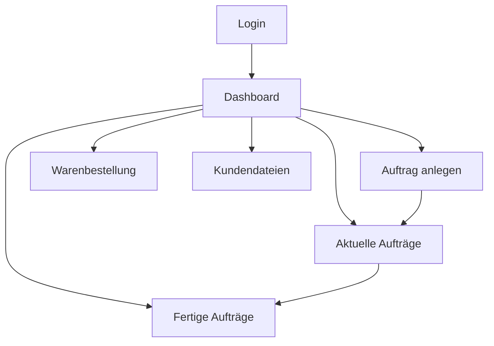

## 1. Produktübersicht
Das Main Textildruck Management System ist eine webbasierte Anwendung für die Verwaltung von Textildruckaufträgen und Mitarbeiterdaten. Das System ermöglicht eine effiziente Auftragsverwaltung, Lagerverwaltung und Kundendateiorganisation.

Das Produkt hilft der Main Textildruck GmbH interne Prozesse zu digitalisieren, Mitarbeiter zu verwalten und Aufträge von der Erfassung bis zur Fertigstellung zu verfolgen.

## 2. Kernfunktionen

### 2.1 Benutzerrollen

| Rolle | Registrierungsmethode | Kernberechtigungen |
|------|---------------------|------------------|
| Mitarbeiter | Admin-erstellung | Dashboard einsehen, Aufträge verwalten, eigene Daten bearbeiten |
| Admin | System-Setup | Mitarbeiter erstellen/bearbeiten, alle Aufträge einsehen, Systemeinstellungen |

### 2.2 Funktionsmodule

Das Management System besteht aus folgenden Hauptseiten:
1. **Login-Seite**: Benutzeranmeldung mit Firmenbranding
2. **Dashboard**: Übersicht mit Auftragsstatistiken und Navigation
3. **Auftragserfassung**: Neue Aufträge anlegen und bearbeiten
4. **Aktuelle Aufträge**: Laufende Aufträge verwalten und bearbeiten
5. **Fertige Aufträge**: Abgeschlossene Aufträge archivieren und einsehen
6. **Warenbestellung**: Materialbestellungen verwalten
7. **Kundendateien**: Druckdateien zuordnen und verwalten

### 2.3 Seitendetails

| Seitenname | Modulname | Funktionsbeschreibung |
|-----------|-------------|---------------------|
| Login-Seite | Anmeldung | Mitarbeiter können sich mit Benutzername und Passwort anmelden |
| Dashboard | Übersicht | Zeigt aktuelle Auftragszahlen, offene Bestellungen und Quick-Actions an |
| Dashboard | Navigation | Hauptmenü mit Zugriff auf alle Module |
| Auftragserfassung | Neuer Auftrag | Auftragsdetails eingeben: Kunde, Artikel, Menge, Lieferdatum |
| Auftragserfassung | Kundenauswahl | Bestehende Kunden auswählen oder neue anlegen |
| Aktuelle Aufträge | Auftragsliste | Alle laufenden Aufträge mit Status und Bearbeitungsoptionen |
| Aktuelle Aufträge | Status-Update | Auftragsstatus ändern (Design, Druck, Fertigung, Versand) |
| Fertige Aufträge | Archiv | Abgeschlossene Aufträge durchsuchen und Details einsehen |
| Warenbestellung | Bestellformular | Neue Materialbestellung anlegen mit Artikel und Menge |
| Warenbestellung | Bestellübersicht | Offene und erledigte Bestellungen verwalten |
| Kundendateien | Datei-Upload | Druckdateien zu Kunden hochladen und kategorisieren |
| Kundendateien | Dateiverwaltung | Dateien herunterladen, löschen und Versionen verwalten |

## 3. Kernprozesse

### Mitarbeiter Flow:
1. Mitarbeiter meldet sich auf der Login-Seite an
2. Dashboard zeigt persönliche Übersicht und Auftragsstatus
3. Neue Aufträge können über "Auftrag anlegen" erstellt werden
4. In "Aktuelle Aufträge" können bestehende Aufträge bearbeitet und der Status aktualisiert werden
5. Fertige Aufträge werden automatisch ins Archiv verschoben
6. Materialbestellungen können über das Bestellsystem aufgegeben werden
7. Kundendateien können hochgeladen und verwaltet werden

### Admin Flow:
1. Admin kann neue Mitarbeiter im System anlegen
2. Vollzugriff auf alle Aufträge und Systemfunktionen
3. Kann Benutzerrechte und Systemeinstellungen verwalten

## 4. Benutzeroberfläche

### 4.1 Design-Stil
- Primärfarbe: Roter Farbverlauf (wie im Logo - dunkelrot zu hellrot)
- Sekundärfarbe: Dunkelgrau/Anthrazit (wie "TEXTILDRUCK" im Logo)
- Button-Stil: Abgerundete Ecken mit moderner 3D-Optik
- Schriftart: Geometrische Sans-Serif, klar und modern
- Layout-Stil: Karten-basiert mit sauberer Struktur
- Icons: Minimalistische Line-Icons in Unternehmensfarben

### 4.2 Seitendesign Überblick

| Seitenname | Modulname | UI-Elemente |
|-----------|-------------|-------------|
| Login-Seite | Anmeldeformular | Zentriertes weißes Formular auf rotem Farbverlauf-Hintergrund, Firmenlogo prominent platziert |
| Dashboard | Header | Roter Header mit Logo, Benutzername und Logout-Button |
| Dashboard | Statistik-Karten | Weiße Karten mit roten Akzenten, zeigen Auftragszahlen und Status an |
| Auftragserfassung | Formular | Strukturiertes weißes Formular mit roten Call-to-Action Buttons |
| Aktuelle Aufträge | Tabelle | Saubere weiße Tabelle mit roten Status-Indikatoren und grauen Headern |
| Warenbestellung | Bestellkarte | Moderne Kartenansicht mit Produktbildern und Mengenauswahl |
| Kundendateien | Datei-Manager | Grid-Ansicht mit Vorschau, rote Download-Buttons, graue Lösch-Icons |

### 4.3 Responsive Design
- Desktop-First Ansatz mit responsiver Anpassung für Tablets
- Touch-Optimierung für mobile Geräte
- Breakpoints: Desktop (1200px+), Tablet (768px-1199px), Mobile (<768px)

### 4.4 Branding-Integration
- Firmenlogo prominent in Kopfzeile und Login-Bereich
- Roter Farbverlauf als Hauptakzentfarbe für wichtige Elemente
- Dunkelgrau für Text und sekundäre Elemente
- Saubere, professionelle Optik die Handwerksqualität widerspiegelt